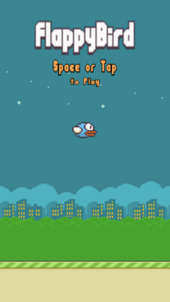

# Flappy Bird Clone

Welcome to the repository of the Flappy Bird clone! This project is a modern reimplementation of the classic Flappy Bird game using React, TypeScript, and the JavaScript Canvas API. Built with the performance-first approach of Vite as the build tool, this clone aims to provide smooth and responsive gameplay.

## Features

- **Classic Gameplay**: Experience the endlessly fun gameplay of dodging obstacles as you navigate the bird through the courses.
- **High-Performance Graphics**: Leveraging the power of JavaScript Canvas for fluid animations and effects.
- **Responsive Design**: Optimized for a variety of devices, ensuring a consistent gaming experience.

## Getting Started

These instructions will get you a copy of the project up and running on your local machine for development and testing purposes.

## Installation

Clone the repository:

```bash
git clone https://github.com/your-username/flappy-bird-clone.git
cd flappybirdclone
npm install
npm run dev
```

## Acknowledgments
Hat tip to the original creators of Flappy Bird for inspiring this project.

## Snapshot

